# Connect to OIG and Oracle Database

## Introduction

Establish Connection to Oracle Database and Oracle Identity Governance

* Persona: LiveLab User

*Estimated Time*: 15 minutes


### Objectives

In this lab, you will:

* Establish Connection to an Oracle Identity Governance and an Oracle Database

### Prerequisites

This lab assumes you have:

A valid Oracle OCI tenancy, with OCI administrator privileges.


    

## Task 1: Verify the Private IP address of Compute Instance from the Terminal

1. Open the terminal session. Here you can find the private IP address of Compute Instance. 

2. Notedown the Private IP address of the Compute Instance for reference. We will require to use them in the further labs.

      


## Task 2: Integrate with Oracle Identity Governance

1. On the Oracle Access Governance service home page *refer Lab 2:Task 1*, click on the Navigation Menu icon and select **Service Administration** and then **Orchestrated Systems.**

    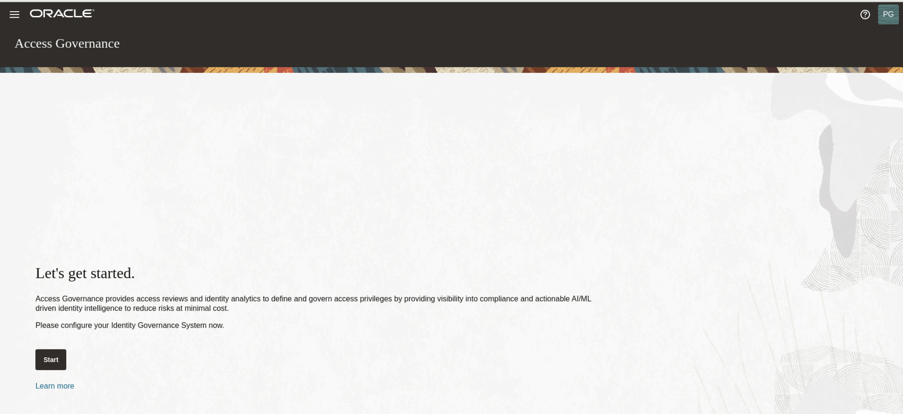

    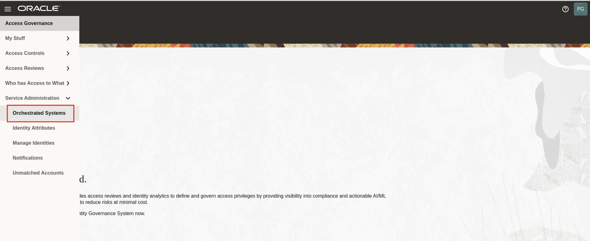

2. Click on **Add an orchestrated system**

    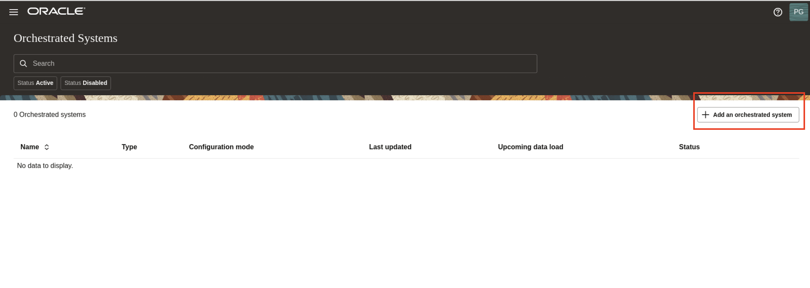

3. On the tile labeled **Select and configure a new orchestrated system**, select **Oracle Identity Governance** to configure the agent for a target Oracle Identity Governance connected system, and then click **Next.**

   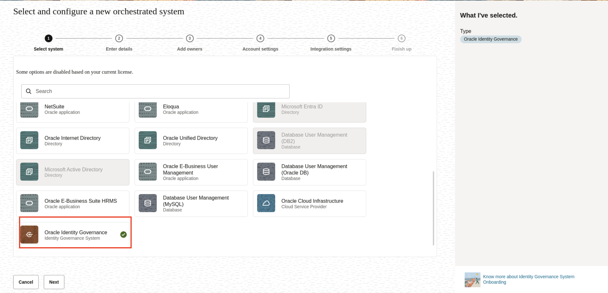

4. On the **Enter Details** step, enter the following details:

    * **Name:** oig
    * **Description:** oig
    * **Click Next.**

    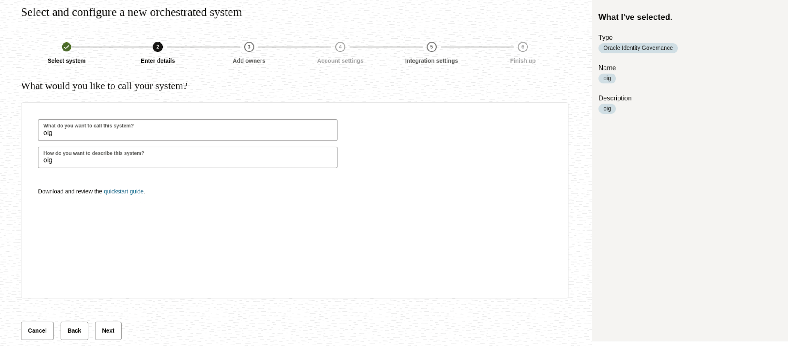


    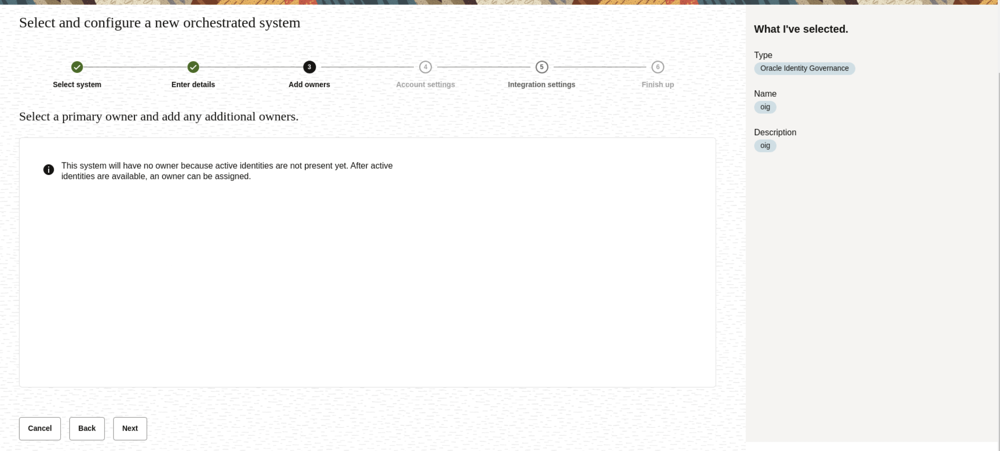

    * **Click Next.**

    

5. On the **Configure** step, enter connection details for the target system:

    **JDBC URL:**
    Replace the placeholder in the below url with the private ip of your compute instance. Refer to *Task 3 : Step 3*  above for the private ip of your compute instance.

    ```
    <copy>jdbc:oracle:thin:@//<--privateipofyourcomputeinstance-->:1521/ORCL.NETWORKSPEOSUBN.IDMOCICLOU02PHX.ORACLEVCN.COM</copy>
    ```

    **OIG Database User Name:**

    ```
    <copy>DEV_OIM</copy>
    ```

    **Password:**

    ```
    <copy>Welcome1</copy>
    ```

    **Confirm Password:**

    ```
    <copy>Welcome1</copy>
    ```

    **OIG Server URL:**
    Replace the placeholder in the below url with the private ip of your compute instance. Refer to *Lab 3 : Task 3*  for the private ip of your compute instance.

    ```
    <copy>http://<--privateipofyourcomputeinstance-->:14000</copy>
    ```

    **OIG Server User Name:**

    ```
    <copy>xelsysadm</copy>
    ```

     **OIG Server User Password:**

    ```
    <copy>Welcome1</copy>
    ```

    **OIG Server Confirm Password:**

    ```
    <copy>Welcome1</copy>
    ```

     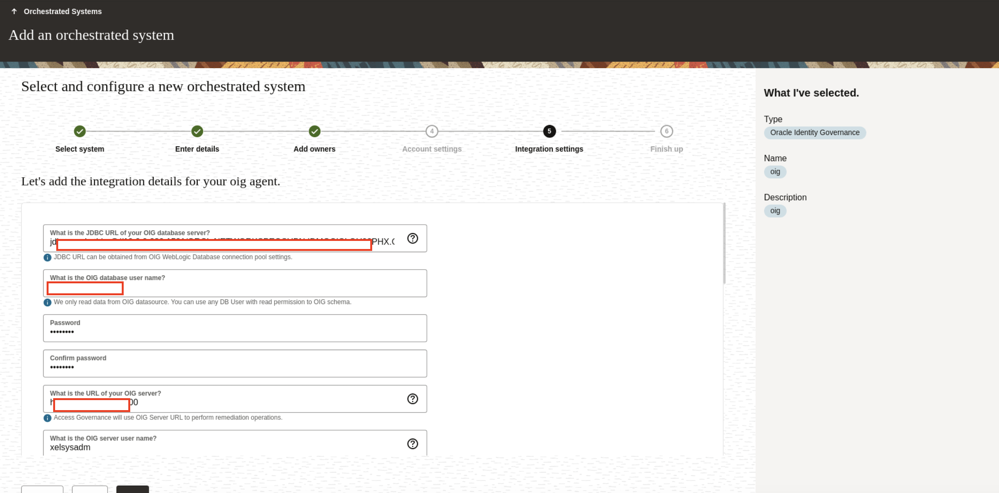

6. On the Download Agent step, select the *Download link* and download the agent zip file. The zip file is present in: /home/opc/Downloads

    

7. You can verify the downloaded agent zip file.

    
    Choose the option Customize before enabling the system for data loads. Click on **I'm done**

     

    Select **Matching Rules -> Manage**

     

    Under **All** , select the following condition:

    Select connected system attribute: Employee Username

    Select operator: equals

    Select Identity attribute: Employee Username

    Click **Save**


    Navigate back to the orchestrated system. It is in draft status. 

    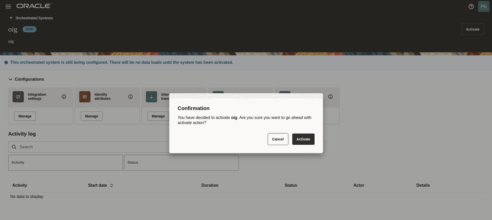

    Click on **Activate**. Confirm the Activation of oig in the pop-up dialog box. 


## Task 3: Install OIG Agent on the Compute Instance and Configure

1. Open the terminal session.

    

2. Move the downloaded zip file (oig.zip) present in the /home/opc/Downloads folder to /home/opc/zip_oag folder.

    ```
    <copy>mv /home/opc/Downloads/oig.zip /home/opc/zip_oag</copy>
    ```

    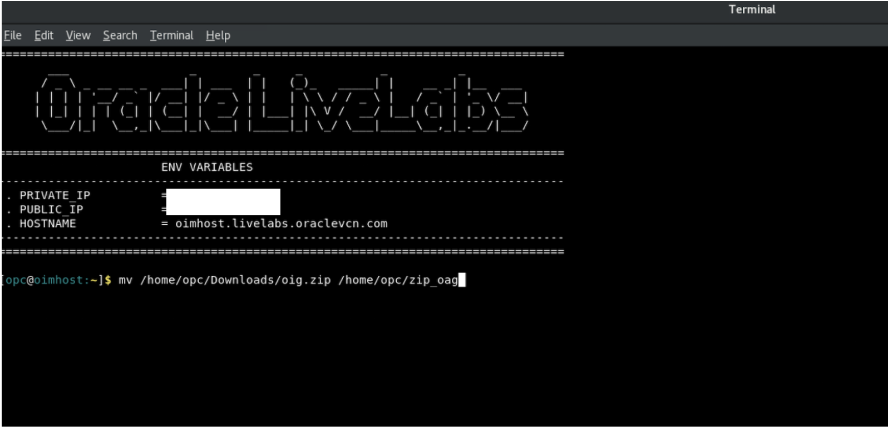

    Verify the Agent zip (oig.zip) is present inside folder zip_oag.

    ```
    <copy>cd /home/opc/zip_oag</copy>
    <copy>ls</copy>
    ```

    

3. Setting the Environment variables using the below command:

    ```
    <copy>cd ~</copy>
    <copy>source oag_agent.env</copy>
    ```

    

4. Install the agent

    ```
    <copy>sh agentManagement.sh --volume /home/opc/vol_oag --agentpackage /home/opc/zip_oag/oig.zip --install</copy>
    ```

    

5. Start the agent

    ```
    <copy>sh agentManagement.sh --volume /home/opc/vol_oag --start</copy>
    ```

    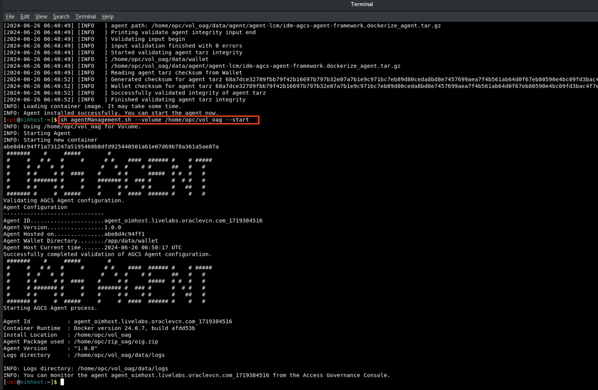

6. Verify the agent

    ```
    <copy>sh agentManagement.sh --volume /home/opc/vol_oag --status</copy>
    ```

    

    Navigate back to the orchestrated system. Click on the Activate on the top-right corner.

    To confirm, click on Activate .
  

    The system is now **Active**. Click on **Load data** now to load the data.


    If the connection details are successfully validated, you will see the **Success** status for the **Validate** operation. The Full Data Load operation may take upto a few minutes, depending upon the data available in your OCI tenancy. The incremental data load is run every four hours for this connected system to sync the data.

    

## Task 4: Connect to Oracle Database and download the DB Agent

1. Navigate to the **Orchestrated Systems** page of the Oracle Access Governance Console, by following these steps:
  From the Oracle Access Governance navigation menu icon **Navigation menu**, select **Service Administration** → **Orchestrated  Systems**.
  Click the **Add an orchestrated system** button to start the workflow.

2. From the **Select and configure a new orchestrated system** page, select **Database User Management (Oracle DB)** and click **Next**.

    

4. On the **Enter Details** step of the workflow, enter the details for the connected system:

    * **What do you want to call your database** : OAG-DB
    * **How do you want to describe this database**: OAG-DB

      Click **Next**

    

5. On the Configure step of the workflow, enter the configuration details required to allow Oracle Access Governance to connect to the target database.

    **Easy Connect URL for Database**:

    **JDBC URL:**
    Replace the placeholder in the below url with the private ip of your compute instance. Refer to *Task 3 : Step 3*  above for the private ip of your compute instance.

    ```
    <copy>jdbc:oracle:thin:@//<—privateipaddressofcomputeinstance-->/ORCL.NETWORKSPEOSUBN.IDMOCICLOU02PHX.ORACLEVCN.COM</copy>
    ```

    **User Name**:

    ```
    <copy>sys as sysdba</copy>
    ```

    **Password**:

    ```
    <copy>Welcome1</copy>
    ```

    **Confirm password**:

    ```
    <copy>Welcome1</copy>
    ```

    

6. Check the right hand pane to view What I've selected. If you are happy with the details entered, select **Add** to create the connected system.

7. On the Finish Up step of the workflow, you are asked to download the agent you will use to interface between Oracle Access Governance and Oracle Database. Select the **Download** link to download the agent zip file to the environment in which the agent will run. Click on **Activate** and **I'm done**

    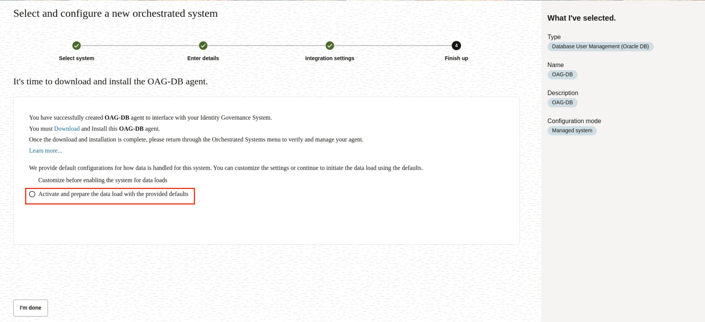

    


## Task 5: Install the DB Agent on the Target System

1. Open the terminal.

2. Create the volume.

    ```
    <copy>mkdir  /home/opc/vol_oag_db</copy>
     ```

3. Verify the Agent zip (OAG-DB.zip) is present inside folder Downloads.

    ```
    <copy> cd /home/opc/Downloads
    ls</copy>
     ```

4. Setting the Environment variables using the below command:

    ```
    <copy> cd ~
    source oag_agent.env</copy>
     ```

2. Install the agent using the below commands:

     ```
    <copy>curl https://raw.githubusercontent.com/oracle/docker-images/main/OracleIdentityGovernance/samples/scripts/agentManagement.sh -o agentManagement.sh;</copy>
     ```

     ```
    <copy>sh agentManagement.sh --volume /home/opc/vol_oag_db --agentpackage /home/opc/Downloads/OAG-DB.zip --install</copy>
     ```

3. Start the agent with the following command:

     ```
      <copy>sh agentManagement.sh --volume /home/opc/vol_oag_db --start</copy>
     ```

## Task 6: Verify the Agent Installation

1. Login to the Oracle Access Governance Console, select the Navigation Menuicon to display the navigation menu.
2. In the Oracle Access Governance Console, select Service Administration → Orchestrated Systems from the navigation menu.
3. Click on **Activate**

    

4. Confirm **Activate** the orchestrated system.

    

5. The Orchestrated system is now in **Active** status. 

    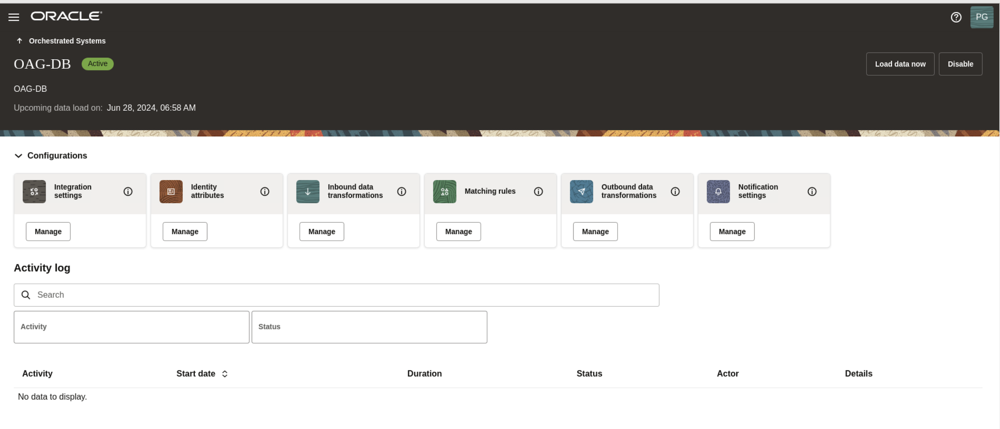

6. Click **Load Data** and confirm. 

    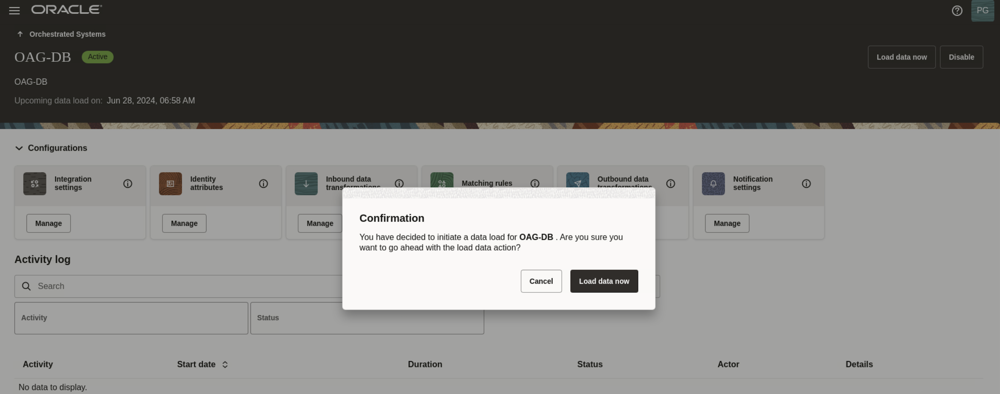

7. On the Orchestrated Systems screen, the tile showing the name of the orchestrated system shows a status of Waiting for initial connection. Click on Manage Connection.

8. The Activity Log at the bottom of the page will show the status of the Validate operation, Pending while the agent comes up. If the agent does not come up, check the agent install and operation logs for any issues.

    

9. Once the agent has come up, the status of the Validate operation will show as Success.Full Dataload has also been completed with status Success. 

  You may now **proceed to the next lab**.

## Learn More

* [Oracle Access Governance Create Access Review Campaign](https://docs.oracle.com/en/cloud/paas/access-governance/pdapg/index.html)
* [Oracle Access Governance Product Page](https://www.oracle.com/security/cloud-security/access-governance/)
* [Oracle Access Governance Product tour](https://www.oracle.com/webfolder/s/quicktours/paas/pt-sec-access-governance/index.html)
* [Oracle Access Governance FAQ](https://www.oracle.com/security/cloud-security/access-governance/faq/)

## Acknowledgements

* **Authors** - Anuj Tripathi, Anbu Anbarasu
* **Last Updated By/Date** - Indira Balasundaram 29 May 2024