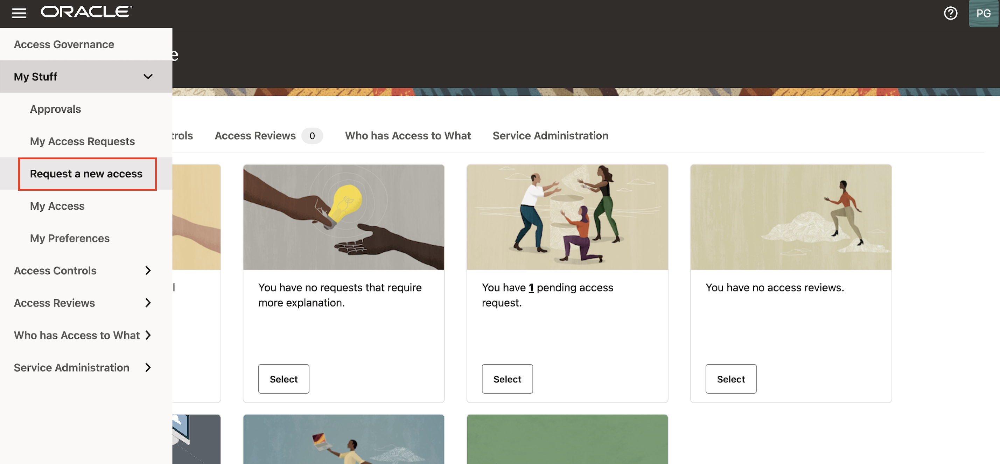
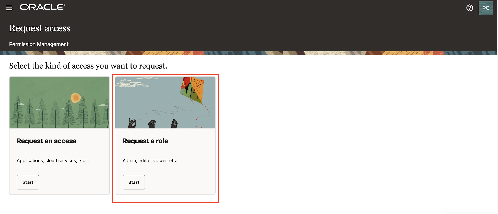
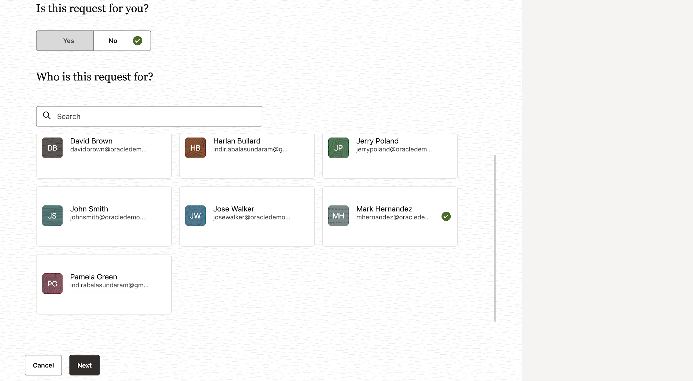
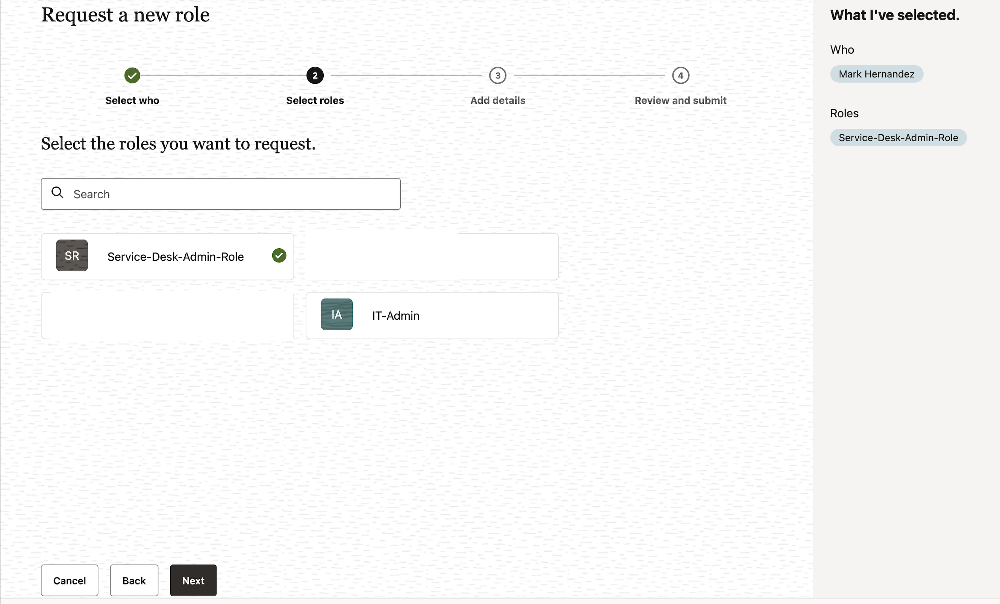
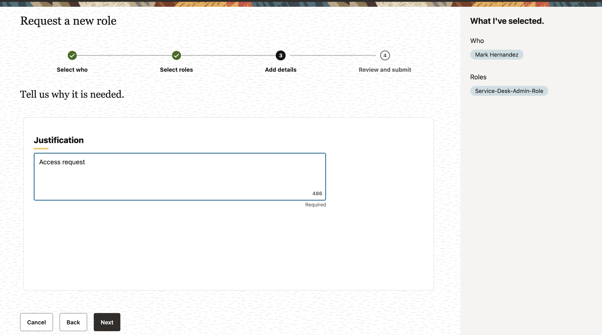
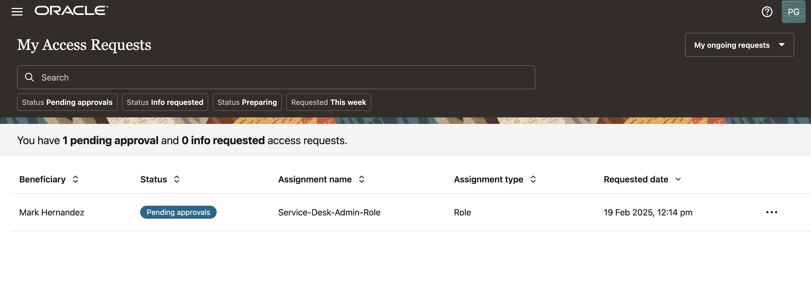
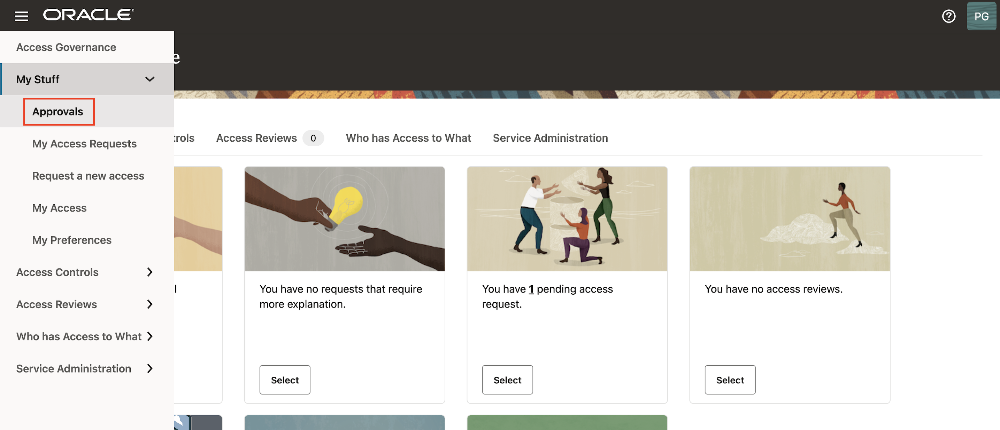
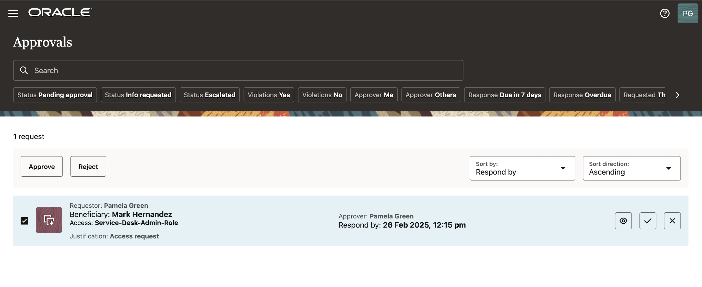
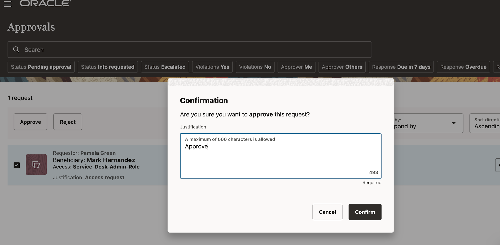

# Application Role Provisioning

## Introduction

In this lab we will review Access-Control of Access Governance

*Estimated Time*: 15 minutes

### Objectives

In this lab, you will:

* Create access request for Application Role Provisioning
* Approve access request for Application Role Provisioning

### Prerequisites

This lab assumes you have:

A valid Oracle OCI tenancy, with OCI administrator privileges.

## Task 1: Create Access Request

  1. On the Oracle Access Governance Console home page, from the navigation menu, select **My Stuff -> Request a new access**

     

  2. Under **Select the kind of access you want to request** , select **Request a role** 

      

  3. Under **Is this request for you?** , select **No** and choose the user **Mark Hernandez** for who this request is for. 

     

     Click **Next**

  4. Under **Select the roles** you want to request, select the role **Service-desk-admin-role**

    

    Click on **Next**

  5. Under We need some additional information for this request -> Provide Justification.

     

  6. Click on **Submit Request**

  

  

## Task 2: Approve Access Requests

1. Navigate to MyStuff -> Approvals.You will see requests for the user Mark Hernandez for **Service-desk-admin-role** .

   

2. Under Actions, click on approve and Approve the request for the user Mark Hernandez. 

   

   

## Task 3: Run the Data Load

1. On the Access Governance console home page, navigate to Service Administration -> Orchestrated Systems

2. On the Connected Systems page, select the **OCI-IAM** orchestrated system.

3. Click on  Actions -> Load Data Now. This will perform a manual data load.

4. Once the data load is complete, the status will be shown as Success.

    You may now **proceed to the next lab.**

## Learn More

* [Oracle Access Governance Create Access Review Campaign](https://docs.oracle.com/en/cloud/paas/access-governance/pdapg/index.html)
* [Oracle Access Governance Product Page](https://www.oracle.com/security/cloud-security/access-governance/)
* [Oracle Access Governance Product tour](https://www.oracle.com/webfolder/s/quicktours/paas/pt-sec-access-governance/index.html)
* [Oracle Access Governance FAQ](https://www.oracle.com/security/cloud-security/access-governance/faq/)

## Acknowledgements

* **Authors** - Anuj Tripathi
* **Contributors** - Anbu Anbarasu
* **Last Updated By/Date** - Anuj Tripathi, October 2023
